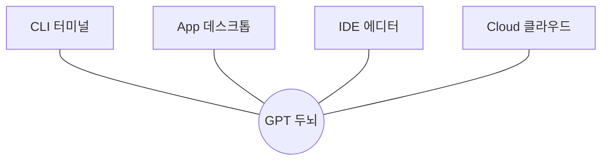

## 011. Codex의 네 가지 얼굴 — App / CLI / IDE / Cloud



Codex는 하나가 아닙니다. 같은 두뇌(GPT-5.6)를 네 가지 몸으로 만날 수 있습니다. 상황에 맞게 고르면 됩니다.

### 1) CLI — 터미널의 Codex

```bash
codex
```

- 터미널에서 실행하는 본체. 이 책의 주 무대입니다.
- 가볍고 빠르며, 자동화·스크립트와 잘 맞습니다.
- 로컬 머신에서 수 시간짜리 긴 작업도 버팁니다.

> 왜 CLI로 배우나? CLI를 이해하면 나머지 셋(App·IDE·Cloud)은 자연스럽게 따라옵니다. 가장 투명하게 동작을 보여 주기 때문입니다.

### 2) App — 데스크톱 앱의 Codex

```bash
codex app
```

- 프로젝트 사이드바, 대화 스레딩, 리뷰 화면 등 GUI 경험.
- 마우스로 편하게 여러 작업을 오가고 싶을 때.
- ChatGPT의 Codex 페이지(웹 앱)로도 접근 가능.

### 3) IDE 확장 — 에디터 안의 Codex

- VS Code · Cursor · Windsurf에 설치해 에디터 안에서 바로 사용.
- 열려 있는 파일과 선택한 코드 범위를 자동으로 컨텍스트에 넣어 줍니다.
- 코드를 보면서 바로 시키는 흐름에 최적.

### 4) Cloud(Web) — 클라우드의 Codex

- 작업을 클라우드 격리 환경에서 비동기로 실행.
- GitHub 저장소와 연동, 이슈·PR에서 `@codex` 태그로 작업 트리거, PR 자동 생성.
- 여러 작업을 병렬로 돌리기 좋음 (→ 081번).

### 한눈에 비교

| 형태 | 강점 | 이럴 때 |
|---|---|---|
| CLI | 투명·자동화·장시간 | 일상 개발, 스크립트, 학습 |
| App | 편한 GUI, 멀티 스레드 | 마우스 위주, 여러 작업 관리 |
| IDE | 에디터 통합, 자동 컨텍스트 | 코드 보며 즉시 작업 |
| Cloud | 격리·병렬·GitHub 연동 | 비동기 대량 작업, 팀 협업 |

### 중요한 사실: 설정을 공유한다

네 가지는 따로 노는 게 아닙니다. 많은 설정(예: MCP 서버, AGENTS.md 규칙)을 공유합니다. 한 번 잘 설정해 두면 어디서든 같은 방식으로 일합니다.

```text
        ┌──────────── 공유 설정 ────────────┐
        │  config.toml · AGENTS.md · MCP    │
        └───────────────────────────────────┘
           ↑        ↑          ↑         ↑
         CLI      App        IDE      Cloud
```

### 이 책의 선택

- 메인: CLI (Part 1~3 학습)
- 곁들임: IDE (057번에서 실습), Cloud (081~082번에서 실습)
- 개념을 CLI로 익히면 나머지는 "같은 두뇌, 다른 화면"일 뿐입니다.

### 정리

- Codex = 같은 GPT 두뇌의 네 가지 몸: CLI · App · IDE · Cloud
- 이 책은 가장 투명한 CLI로 배운 뒤, IDE·Cloud로 확장
- 설정은 서로 공유되므로 한 번 잘 만들면 어디서든 통한다

다음 절에서는 실제로 손을 움직입니다 — 개발 환경 준비부터 시작합니다.
