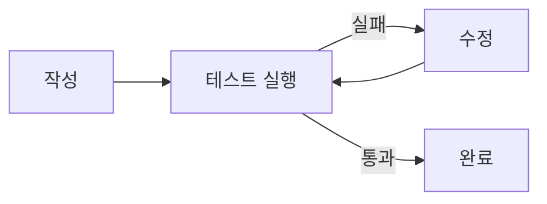

## 026. 좋은 프롬프트 3 — 검증을 포함시키기



세 번째이자 가장 강력한 비결입니다. 이 책이 처음부터 끝까지 반복하는 한 문장으로 시작합시다.

> "Codex는 자기 작업을 검증할 수 있을 때 더 높은 품질의 결과를 낸다." (OpenAI 공식 가이드)

### 왜 검증이 품질을 만드나

AI가 코드를 짜고 스스로 테스트를 돌려 통과를 확인하면, 틀린 코드를 그 자리에서 발견해 고칩니다. 검증 수단이 없으면 AI는 "아마 될 거예요"에서 멈춥니다 — 그게 환각의 온상입니다.

```text
검증 없음:  코드 작성 → "완료!" (사실은 버그)
검증 있음:  코드 작성 → 테스트 실행 → 실패 → 원인 분석 → 수정 → 통과 → 진짜 완료
```

### 검증을 프롬프트에 "심는" 법

요청할 때 어떻게 확인할지를 함께 알려주세요.

1) 테스트 작성 요청
```text
todo 추가 기능을 만들고, pytest로 다음을 검증하는 테스트도 함께 작성해줘:
- 정상 추가되면 201을 반환
- 제목이 비면 400을 반환
그리고 테스트를 실행해서 통과하는지 보여줘.
```

2) 재현 방법 제공 (버그 수정 시)
```text
장바구니 합계가 틀려. 재현: 1000원짜리 2개 담으면 1800원이 나와 (할인 없음).
원인을 찾아 고치고, 이 케이스를 검증하는 테스트를 추가해줘.
```

3) 실행 확인 요청
```text
다 만든 뒤 서버를 실행해서 /health 엔드포인트가 200을 주는지 확인해줘.
```

### "검증 가능하게" 만드는 도구들

- 테스트 — pytest, jest 등 (가장 강력)
- 린터/타입체크 — 코드 스타일·타입 오류 자동 검출
- 실행/빌드 — 실제로 돌려 보기
- 재현 절차 — 버그를 다시 일으키는 정확한 방법

> TIP "테스트 먼저"를 요청하는 것도 강력합니다. "이 기능의 테스트를 먼저 작성하고, 그 테스트를 통과하도록 구현해줘." (테스트 주도 방식)

### 검증은 사람의 안전장치이기도

AI가 테스트를 통과시켰다고 끝이 아닙니다. 사람도 확인합니다.

1. `/diff`로 변경 검토 (→ 020번)
2. 테스트가 정말 의미 있는 걸 검증하는지 확인
3. 직접 한 번 실행

> AI가 "테스트가 통과했다"고 해도, 그 테스트가 허술할 수 있습니다. 무엇을 검증했는지를 보세요. 고급편 Goal 모드(044번)에서는 Codex 스스로 "완료를 증거로 입증"하게 만드는 내부 장치까지 다룹니다.

### 실습: 검증을 넣어 다시 시키기

017번에서 만든 계산기/구구단 중 하나를 골라, 이렇게 다시 시켜 보세요.

```text
이 프로그램에 대한 테스트를 작성하고 실행해서, 결과가 올바른지 증명해줘.
```

테스트가 통과하는 모습을 직접 확인하세요. "되는 걸 봤다"와 "될 거 같다"는 완전히 다릅니다.

### 좋은 프롬프트 3부작 총정리

```text
① 명확하게   — 무엇을·어떻게·어디에·완료기준
② 쪼개서     — 작고 얇은 단위로
③ 검증 포함  — 테스트·재현·실행으로 스스로 확인하게
```

이 세 가지만 몸에 익혀도 당신은 상위 10%의 AI 사용자입니다.

### 정리

- 검증 가능성이 곧 품질 — AI가 스스로 틀림을 잡게 한다
- 프롬프트에 테스트·재현·실행 확인을 심어라
- AI의 "통과"도 사람이 한 번 더 검토
- 3부작: 명확하게 → 쪼개서 → 검증 포함

다음 두 절은 지금까지 배운 걸 모으는 종합 실습입니다 (계산기, 웹페이지).
