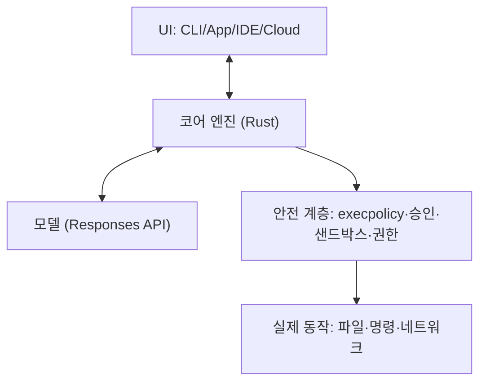

# 061. Codex 아키텍처 큰 그림 (Rust 모노레포)



Part 3, 고급에 오신 걸 환영합니다. 지금부터는 커튼 뒤를 봅니다. Codex가 *실제로* 어떻게 만들어졌는지 이해하면, 문제를 더 깊이 진단하고 더 강력하게 확장할 수 있습니다.

> 이 Part는 내부 원리를 다룹니다. 당장 실무에 급하지 않다면 가볍게 읽고, 필요할 때 돌아와도 됩니다. 하지만 "왜 이렇게 동작하지?"의 답이 여기 있습니다.

## Codex는 오픈소스다

Codex CLI의 코어는 오픈소스(Apache-2.0)입니다. 저장소는 `github.com/openai/codex`이고, 누구나 코드를 읽고, 빌드하고, 포크할 수 있습니다. (클라우드 서비스와 모델 자체는 비공개)

```bash
git clone https://github.com/openai/codex
```

## 무엇으로 만들어졌나

- 언어: Rust (코어의 96%+) — 빠르고 안전한 단일 바이너리
- 빌드: Bazel + Cargo
- 구조: 모노레포(하나의 저장소에 100여 개 크레이트=모듈)

> Rust를 택한 이유는 성능과 메모리 안전성, 그리고 OS 네이티브 샌드박스(070번)를 직접 구현하기 위함입니다.

## 큰 구성 요소

저장소는 크게 이렇게 나뉩니다.

```text
codex-rs/        ← 핵심 엔진 (Rust, 100여 크레이트)
codex-cli/       ← npm 배포 래퍼
sdk/             ← TypeScript / Python SDK
docs/            ← 문서
```

`codex-rs` 안의 주요 크레이트(모듈):

| 크레이트 | 역할 |
|---|---|
| `core` | 에이전트 엔진 핵심 (가장 중요) |
| `tui` | 터미널 UI (가장 큼) |
| `app-server` | JSON-RPC 서버 (SDK·IDE·앱 진입점) |
| `sandboxing` / `linux-sandbox` | OS 샌드박스 |
| `execpolicy` | 명령 실행 정책(Starlark) |
| `mcp-server` | Codex를 MCP 서버로 노출 |
| `cloud-tasks` | 클라우드 작업 연동 |

## 전체 동작 흐름 (조감도)

```text
   [사용자/UI]
       │  프롬프트
       ▼
   [Codex 엔진(core)]  ── 모델 API(WebSocket) ──▶ [GPT-5.6]
       │  도구 호출(파일/명령/MCP)
       ▼
   [샌드박스 + execpolicy + 승인]  ← 안전 계층
       │
       ▼
   [실제 파일 편집 / 명령 실행]
```

이 흐름의 각 부분을 이어지는 절들에서 하나씩 해부합니다.

- 062: 엔진과 UI의 통신 방식(SQ/EQ)
- 063: Session·Task·Turn 생명주기
- 064: 모델과의 WebSocket 통신
- 065: 컨텍스트 압축
- 066~070: 프롬프트·편집·정책·샌드박스 내부

## 왜 이걸 알아야 하나

- 디버깅: "왜 이 명령이 막히지?" → execpolicy/샌드박스 이해(068, 070)
- 확장: SDK·훅으로 직접 기능 추가(073, 077)
- 신뢰: 안전 모델을 이해하면 자동화를 더 과감하게(069)
- 트러블슈팅: 동작 원리를 알면 문제 해결이 빨라짐

## 실습 (선택)

직접 코드를 둘러보고 싶다면:

```bash
git clone --depth 1 https://github.com/openai/codex
cd codex/codex-rs
ls           # 크레이트 목록 구경
```

Codex에게 "이 저장소 구조를 설명해줘"라고 시켜도 좋습니다 — AI로 AI의 소스를 읽는 경험!

## 정리

- Codex CLI 코어 = 오픈소스 Rust 모노레포(Apache-2.0)
- 핵심: `core`(엔진), `tui`(UI), `app-server`(통합 진입점), 샌드박스·정책
- 흐름: UI → 엔진 → (모델 통신 + 안전 계층) → 실제 작업
- 내부를 알면 디버깅·확장·신뢰가 강해진다

---

다음 절에서 엔진과 UI가 대화하는 방식 — SQ/EQ 큐 모델을 봅니다.
