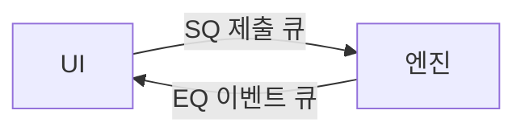

## 062. 코어 프로토콜 — SQ/EQ 큐 모델



Codex 엔진과 UI(터미널·앱·IDE)는 어떻게 대화할까요? 답은 두 개의 큐(queue) 입니다. 이 모델을 이해하면 Codex의 모든 인터페이스가 한 번에 이해됩니다.

### 핵심 아이디어: UI와 엔진의 분리

> Codex의 엔진(core)은 UI와 완전히 분리되어 있습니다. 엔진은 "두뇌"이고, UI는 그 두뇌에 붙는 "화면"일 뿐입니다.

그래서 같은 엔진에 CLI·App·IDE·Cloud가 모두 붙을 수 있는 겁니다(011번의 "네 가지 얼굴"이 가능한 이유).

### 두 개의 큐

엔진과 UI는 두 방향의 큐로 메시지를 주고받습니다.

```text
   [UI] ──── SQ (Submission Queue) ────▶ [Codex 엔진]
        ◀─── EQ (Event Queue) ──────────

   SQ: UI → 엔진  (사용자의 요청/조작)
   EQ: 엔진 → UI  (진행 상황/결과)
```

- SQ(Submission Queue, 제출 큐): UI가 엔진에게 보내는 메시지. "이 작업 해줘", "이 명령 승인할게", "중단해" 등.
- EQ(Event Queue, 이벤트 큐): 엔진이 UI에게 보내는 메시지. "모델이 이렇게 답했어", "이 명령 승인해줄래?", "턴 끝났어" 등.

### Submission과 Op

UI가 보내는 메시지를 Submission이라 하고, 그 내용(종류)을 `Op`라고 부릅니다.

주요 `Op` 예:

| Op | 의미 |
|---|---|
| `Op::UserTurn` | 사용자 입력으로 새 작업(턴) 시작 |
| `Op::Interrupt` | 진행 중인 턴 중단 |
| `Op::ExecApproval` | 명령 실행 승인/거부 |
| `Op::UserInputAnswer` | 도구가 물어본 질문에 답 |

> 각 Submission에는 UI가 붙인 ID(`sub_id`)가 있어, 어떤 요청에 대한 응답인지 추적합니다.

### Event와 EventMsg

엔진이 보내는 메시지는 Event, 그 내용은 `EventMsg` 입니다.

주요 `EventMsg` 예:

| EventMsg | 의미 |
|---|---|
| `AgentMessage` | 모델의 메시지 |
| `AgentMessageContentDelta` | 스트리밍되는 텍스트 조각 |
| `ExecApprovalRequest` | 명령 실행 승인 요청 |
| `TurnStarted` / `TurnComplete` | 턴 시작/완료 |
| `Error` / `Warning` | 오류/경고 |

UI는 이 이벤트들을 받아 화면에 그립니다. 예를 들어 `ExecApprovalRequest`가 오면 승인 프롬프트를 띄우는 거죠(019번).

### 왜 큐 모델인가

- 유연한 전송: 큐는 스레드 간 채널, 파이프(stdin/stdout), TCP, gRPC 등 어떤 전송 방식 위에서도 동작합니다. 그래서 로컬·원격 어디든 같은 엔진을 씁니다.
- 비동기: UI는 요청을 보내고 기다리지 않아도 됩니다. 이벤트가 오는 대로 처리.
- 스트리밍: 모델의 답이 조각조각(`...Delta`) 흘러오며 실시간 표시됩니다.

> 이벤트는 줄 단위 JSON으로 깔끔하게 직렬화됩니다. 즉 사람이 읽을 수 있는 형태로 흐릅니다.

### 실전에서 의미

- 당신이 입력칸에 친 프롬프트 → `Op::UserTurn`(SQ)
- 화면에 흐르는 응답 → `AgentMessageContentDelta`(EQ)
- 뜨는 승인창 → `ExecApprovalRequest`(EQ), 당신의 클릭 → `Op::ExecApproval`(SQ)
- `Esc`로 중단 → `Op::Interrupt`(SQ)

매일 보던 화면 뒤에서 이런 메시지들이 오갔던 겁니다.

### 정리

- 엔진(두뇌)과 UI(화면)는 분리 → 한 엔진에 여러 UI
- 통신은 두 큐: SQ(UI→엔진), EQ(엔진→UI)
- UI 요청 = `Op`(Submission), 엔진 응답 = `EventMsg`(Event)
- 큐는 어떤 전송 위에서도 동작 → 로컬·원격 통합, 비동기·스트리밍

다음 절에서 작업의 단위 구조 — Session · Task · Turn을 봅니다.
