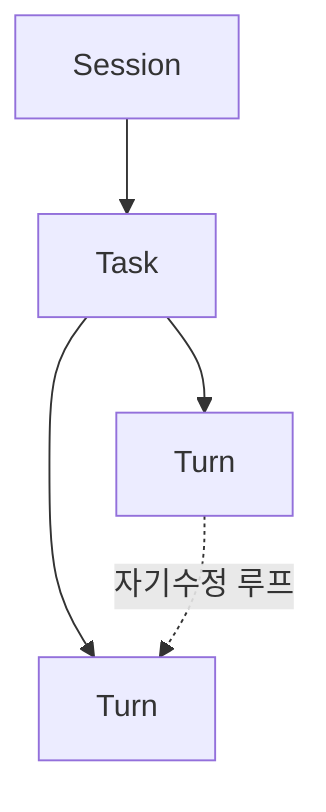

## 063. Session > Task > Turn 생명주기



Codex의 작업은 Session > Task > Turn 이라는 3단 계층으로 구성됩니다. 이 구조를 알면 "왜 작업이 중단됐지?", "어떻게 이어가지?"가 명쾌해집니다.

### 3단 계층 한눈에

```text
Session (설정·상태)
  └─ Task (하나의 사용자 요청에 대한 작업)
       └─ Turn (요청→응답→행동의 1사이클)
            └─ Turn
            └─ Turn ...
```

### 1) Session — 설정과 상태

> 현재 Codex의 구성과 상태입니다.

- Codex는 처음엔 Session이 없습니다. UI가 가장 먼저 "세션을 구성"하는 메시지를 보내 시작됩니다.
- 모델, 샌드박스, 승인 정책, 작업 폴더 등이 Session에 담깁니다.
- 세션을 재구성하면 진행 중인 작업은 중단됩니다.

### 2) Task — 하나의 작업

> 사용자 입력에 대응해 Codex가 수행하는 한 덩어리 작업입니다.

- 한 Session에는 동시에 하나의 Task만 실행됩니다.
- `Op::UserTurn`(사용자 입력)이 새 Task를 시작합니다.
- Task는 여러 Turn으로 이뤄집니다.

Task가 끝나는 조건:
- 모델이 작업을 완료하고 더 이상 할 게 없을 때
- 새 사용자 입력이 들어와 현재 작업을 중단하고 새 작업을 시작할 때
- 사용자가 `Op::Interrupt`로 중단할 때
- 치명적 오류(예: 모델 연결 재시도 한도 초과)
- 승인 대기로 멈출 때(명령/패치 승인 필요)

> "한 번에 하나의 Task"라서, 병렬 작업은 여러 Codex 인스턴스(스레드)로 한다고 했던 것(043번)이 여기서 이해됩니다.

### 3) Turn — 한 사이클

> Task 안의 한 번의 반복입니다.

한 Turn의 구성:
1. 모델에 요청 보내기 (프롬프트 또는 이전 Turn의 출력)
2. 모델이 응답을 스트리밍 (완료 신호까지 수집)
3. Codex가 명령 실행·패치 적용·메시지 출력
4. 필요하면 승인을 위해 일시정지

한 Turn의 출력이 다음 Turn의 입력이 됩니다. 출력이 없으면(더 할 게 없으면) Task가 끝납니다.

```text
Turn 1: "테스트 추가해줘" → 코드 작성 → 테스트 실행 → 실패
Turn 2: (실패 결과 입력) → 원인 분석 → 수정 → 테스트 → 통과
Turn 3: (할 일 없음) → Task 종료
```

이 반복이 바로 에이전트가 "스스로 고쳐가며 일하는" 메커니즘입니다(010번).

### response_id — 북마크와 분기

각 Turn이 끝나면 모델의 최종 응답에 `response_id`가 붙어 Session에 저장됩니다.

- 이 ID로 다음 사용자 입력 때 스레드를 이어갑니다.
- 과거의 특정 `response_id`를 지정하면 그 지점에서 분기(fork) 할 수 있습니다(043번 `/fork`의 원리).

> `response_id`는 OpenAI Responses API의 응답 ID와 같습니다. 그래서 나중 세션에서도 작업 맥락을 재개할 수 있습니다.

### 실전 매핑

| 당신이 한 일 | 내부 |
|---|---|
| `codex` 실행 + 설정 | Session 생성 |
| 프롬프트 입력 | Task 시작(`Op::UserTurn`) |
| AI가 짜고-돌리고-고치고 반복 | 여러 Turn |
| `Esc` | `Op::Interrupt` → Task 종료 |
| `/fork` | 과거 `response_id`에서 분기 |
| `codex resume` | 저장된 스레드로 Session 재개 |

### 정리

- 계층: Session(설정/상태) > Task(한 작업) > Turn(한 사이클)
- 한 Session엔 한 Task만 동시 실행(병렬은 인스턴스 분리)
- Turn의 출력이 다음 Turn의 입력 → 자가 수정 루프
- `response_id`가 북마크 → 재개·분기의 기반

다음 절에서 엔진이 모델과 실제로 통신하는 방식(WebSocket)을 봅니다.
